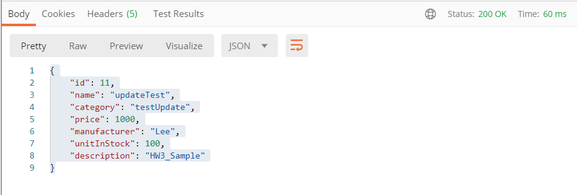

## 1. Main URL

#### 먼저 resources의 application.properties 

#### 여기서 포트를 지정한다(9090)

```properties
server.port=9090

spring.datasource.url=jdbc:mysql://localhost:3306/helloproductdb-1591025?characterEncoding=UTF-8&serverTimezone=Asia/Seoul
spring.datasource.username=root
spring.datasource.password=741963

spring.jpa.hibernate.ddl-auto	=create

spring.datasource.initialization-mode=always

info.app.name=My Super Cool App
info.app.descritions=A fun app
info.app.version=1.0.0

#management.endpoints.web.exposure.include=mappings,health
management.endpoints.web.exposure.include=*

#logging
logging.level.kr.ac.hansung.cse=INFO
logging.file.name=app1.log
```

#### 여기는 주소 /api/v1 를 지정한다

```java
@RestController
@RequestMapping("/api/v1")
public class ProductController {
    ...
}
```


#### 이렇게 Main URL은

#### http://localhost:9090/api/v1/ 이 된다


## 2. API method

#### - POST|http://localhost:9090/api/v1/products


---

### - GET|http://localhost:9090/api/v1/products


---

### - GET |http://localhost:9090/api/v1/products/1


---

### - GET|http://localhost:9090/api/v1/products/category/etc


------

### -PUT|http://localhost:9090/api/v1/products/11

#### Body

```json
{

  "name": "updateTest",

  "category": "testUpdate",

  "price": 1000

}
```

#### response




---

#### - DELETE|http://localhost:9090/api/v1/products/10


204 No Content가 나오면 성공이다

body부분은 비어서 온다.


## 3. URL Mapping

### 주소 : http://localhost:9090/actuator/mappings


#### 결과값(현재 CustomerController의 URL도 출력이 된다.)

```json
{
  "contexts": {
    "application": {
      "mappings": {
        "dispatcherServlets": {
          "dispatcherServlet": [
            {
              "handler": "Actuator web endpoint 'beans'",
              "predicate": "{GET /actuator/beans, produces [application/vnd.spring-boot.actuator.v3+json || application/vnd.spring-boot.actuator.v2+json || application/json]}",
              "details": {
                "handlerMethod": {
                  "className": "org.springframework.boot.actuate.endpoint.web.servlet.AbstractWebMvcEndpointHandlerMapping.OperationHandler",
                  "name": "handle",
                  "descriptor": "(Ljavax/servlet/http/HttpServletRequest;Ljava/util/Map;)Ljava/lang/Object;"
                },
                "requestMappingConditions": {
                  "consumes": [],
                  "headers": [],
                  "methods": [ "GET" ],
                  "params": [],
                  "patterns": [ "/actuator/beans" ],
                  "produces": [
                    {
                      "mediaType": "application/vnd.spring-boot.actuator.v3+json",
                      "negated": false
                    },
                    {
                      "mediaType": "application/vnd.spring-boot.actuator.v2+json",
                      "negated": false
                    },
                    {
                      "mediaType": "application/json",
                      "negated": false
                    }
                  ]
                }
              }
            },
            {
              "handler": "Actuator web endpoint 'caches-cache'",
              "predicate": "{GET /actuator/caches/{cache}, produces [application/vnd.spring-boot.actuator.v3+json || application/vnd.spring-boot.actuator.v2+json || application/json]}",
              "details": {
                "handlerMethod": {
                  "className": "org.springframework.boot.actuate.endpoint.web.servlet.AbstractWebMvcEndpointHandlerMapping.OperationHandler",
                  "name": "handle",
                  "descriptor": "(Ljavax/servlet/http/HttpServletRequest;Ljava/util/Map;)Ljava/lang/Object;"
                },
                "requestMappingConditions": {
                  "consumes": [],
                  "headers": [],
                  "methods": [ "GET" ],
                  "params": [],
                  "patterns": [ "/actuator/caches/{cache}" ],
                  "produces": [
                    {
                      "mediaType": "application/vnd.spring-boot.actuator.v3+json",
                      "negated": false
                    },
                    {
                      "mediaType": "application/vnd.spring-boot.actuator.v2+json",
                      "negated": false
                    },
                    {
                      "mediaType": "application/json",
                      "negated": false
                    }
                  ]
                }
              }
            },
            {
              "handler": "Actuator web endpoint 'caches'",
              "predicate": "{DELETE /actuator/caches}",
              "details": {
                "handlerMethod": {
                  "className": "org.springframework.boot.actuate.endpoint.web.servlet.AbstractWebMvcEndpointHandlerMapping.OperationHandler",
                  "name": "handle",
                  "descriptor": "(Ljavax/servlet/http/HttpServletRequest;Ljava/util/Map;)Ljava/lang/Object;"
                },
                "requestMappingConditions": {
                  "consumes": [],
                  "headers": [],
                  "methods": [ "DELETE" ],
                  "params": [],
                  "patterns": [ "/actuator/caches" ],
                  "produces": []
                }
              }
            },
            {
              "handler": "Actuator web endpoint 'caches'",
              "predicate": "{GET /actuator/caches, produces [application/vnd.spring-boot.actuator.v3+json || application/vnd.spring-boot.actuator.v2+json || application/json]}",
              "details": {
                "handlerMethod": {
                  "className": "org.springframework.boot.actuate.endpoint.web.servlet.AbstractWebMvcEndpointHandlerMapping.OperationHandler",
                  "name": "handle",
                  "descriptor": "(Ljavax/servlet/http/HttpServletRequest;Ljava/util/Map;)Ljava/lang/Object;"
                },
                "requestMappingConditions": {
                  "consumes": [],
                  "headers": [],
                  "methods": [ "GET" ],
                  "params": [],
                  "patterns": [ "/actuator/caches" ],
                  "produces": [
                    {
                      "mediaType": "application/vnd.spring-boot.actuator.v3+json",
                      "negated": false
                    },
                    {
                      "mediaType": "application/vnd.spring-boot.actuator.v2+json",
                      "negated": false
                    },
                    {
                      "mediaType": "application/json",
                      "negated": false
                    }
                  ]
                }
              }
            },
            {
              "handler": "Actuator web endpoint 'caches-cache'",
              "predicate": "{DELETE /actuator/caches/{cache}, produces [application/vnd.spring-boot.actuator.v3+json || application/vnd.spring-boot.actuator.v2+json || application/json]}",
              "details": {
                "handlerMethod": {
                  "className": "org.springframework.boot.actuate.endpoint.web.servlet.AbstractWebMvcEndpointHandlerMapping.OperationHandler",
                  "name": "handle",
                  "descriptor": "(Ljavax/servlet/http/HttpServletRequest;Ljava/util/Map;)Ljava/lang/Object;"
                },
                "requestMappingConditions": {
                  "consumes": [],
                  "headers": [],
                  "methods": [ "DELETE" ],
                  "params": [],
                  "patterns": [ "/actuator/caches/{cache}" ],
                  "produces": [
                    {
                      "mediaType": "application/vnd.spring-boot.actuator.v3+json",
                      "negated": false
                    },
                    {
                      "mediaType": "application/vnd.spring-boot.actuator.v2+json",
                      "negated": false
                    },
                    {
                      "mediaType": "application/json",
                      "negated": false
                    }
                  ]
                }
              }
            },
            {
              "handler": "Actuator web endpoint 'health-path'",
              "predicate": "{GET /actuator/health/**, produces [application/vnd.spring-boot.actuator.v3+json || application/vnd.spring-boot.actuator.v2+json || application/json]}",
              "details": {
                "handlerMethod": {
                  "className": "org.springframework.boot.actuate.endpoint.web.servlet.AbstractWebMvcEndpointHandlerMapping.OperationHandler",
                  "name": "handle",
                  "descriptor": "(Ljavax/servlet/http/HttpServletRequest;Ljava/util/Map;)Ljava/lang/Object;"
                },
                "requestMappingConditions": {
                  "consumes": [],
                  "headers": [],
                  "methods": [ "GET" ],
                  "params": [],
                  "patterns": [ "/actuator/health/**" ],
                  "produces": [
                    {
                      "mediaType": "application/vnd.spring-boot.actuator.v3+json",
                      "negated": false
                    },
                    {
                      "mediaType": "application/vnd.spring-boot.actuator.v2+json",
                      "negated": false
                    },
                    {
                      "mediaType": "application/json",
                      "negated": false
                    }
                  ]
                }
              }
            },
            {
              "handler": "Actuator web endpoint 'health'",
              "predicate": "{GET /actuator/health, produces [application/vnd.spring-boot.actuator.v3+json || application/vnd.spring-boot.actuator.v2+json || application/json]}",
              "details": {
                "handlerMethod": {
                  "className": "org.springframework.boot.actuate.endpoint.web.servlet.AbstractWebMvcEndpointHandlerMapping.OperationHandler",
                  "name": "handle",
                  "descriptor": "(Ljavax/servlet/http/HttpServletRequest;Ljava/util/Map;)Ljava/lang/Object;"
                },
                "requestMappingConditions": {
                  "consumes": [],
                  "headers": [],
                  "methods": [ "GET" ],
                  "params": [],
                  "patterns": [ "/actuator/health" ],
                  "produces": [
                    {
                      "mediaType": "application/vnd.spring-boot.actuator.v3+json",
                      "negated": false
                    },
                    {
                      "mediaType": "application/vnd.spring-boot.actuator.v2+json",
                      "negated": false
                    },
                    {
                      "mediaType": "application/json",
                      "negated": false
                    }
                  ]
                }
              }
            },
            {
              "handler": "Actuator web endpoint 'info'",
              "predicate": "{GET /actuator/info, produces [application/vnd.spring-boot.actuator.v3+json || application/vnd.spring-boot.actuator.v2+json || application/json]}",
              "details": {
                "handlerMethod": {
                  "className": "org.springframework.boot.actuate.endpoint.web.servlet.AbstractWebMvcEndpointHandlerMapping.OperationHandler",
                  "name": "handle",
                  "descriptor": "(Ljavax/servlet/http/HttpServletRequest;Ljava/util/Map;)Ljava/lang/Object;"
                },
                "requestMappingConditions": {
                  "consumes": [],
                  "headers": [],
                  "methods": [ "GET" ],
                  "params": [],
                  "patterns": [ "/actuator/info" ],
                  "produces": [
                    {
                      "mediaType": "application/vnd.spring-boot.actuator.v3+json",
                      "negated": false
                    },
                    {
                      "mediaType": "application/vnd.spring-boot.actuator.v2+json",
                      "negated": false
                    },
                    {
                      "mediaType": "application/json",
                      "negated": false
                    }
                  ]
                }
              }
            },
            {
              "handler": "Actuator web endpoint 'conditions'",
              "predicate": "{GET /actuator/conditions, produces [application/vnd.spring-boot.actuator.v3+json || application/vnd.spring-boot.actuator.v2+json || application/json]}",
              "details": {
                "handlerMethod": {
                  "className": "org.springframework.boot.actuate.endpoint.web.servlet.AbstractWebMvcEndpointHandlerMapping.OperationHandler",
                  "name": "handle",
                  "descriptor": "(Ljavax/servlet/http/HttpServletRequest;Ljava/util/Map;)Ljava/lang/Object;"
                },
                "requestMappingConditions": {
                  "consumes": [],
                  "headers": [],
                  "methods": [ "GET" ],
                  "params": [],
                  "patterns": [ "/actuator/conditions" ],
                  "produces": [
                    {
                      "mediaType": "application/vnd.spring-boot.actuator.v3+json",
                      "negated": false
                    },
                    {
                      "mediaType": "application/vnd.spring-boot.actuator.v2+json",
                      "negated": false
                    },
                    {
                      "mediaType": "application/json",
                      "negated": false
                    }
                  ]
                }
              }
            },
            {
              "handler": "Actuator web endpoint 'configprops'",
              "predicate": "{GET /actuator/configprops, produces [application/vnd.spring-boot.actuator.v3+json || application/vnd.spring-boot.actuator.v2+json || application/json]}",
              "details": {
                "handlerMethod": {
                  "className": "org.springframework.boot.actuate.endpoint.web.servlet.AbstractWebMvcEndpointHandlerMapping.OperationHandler",
                  "name": "handle",
                  "descriptor": "(Ljavax/servlet/http/HttpServletRequest;Ljava/util/Map;)Ljava/lang/Object;"
                },
                "requestMappingConditions": {
                  "consumes": [],
                  "headers": [],
                  "methods": [ "GET" ],
                  "params": [],
                  "patterns": [ "/actuator/configprops" ],
                  "produces": [
                    {
                      "mediaType": "application/vnd.spring-boot.actuator.v3+json",
                      "negated": false
                    },
                    {
                      "mediaType": "application/vnd.spring-boot.actuator.v2+json",
                      "negated": false
                    },
                    {
                      "mediaType": "application/json",
                      "negated": false
                    }
                  ]
                }
              }
            },
            {
              "handler": "Actuator web endpoint 'env'",
              "predicate": "{GET /actuator/env, produces [application/vnd.spring-boot.actuator.v3+json || application/vnd.spring-boot.actuator.v2+json || application/json]}",
              "details": {
                "handlerMethod": {
                  "className": "org.springframework.boot.actuate.endpoint.web.servlet.AbstractWebMvcEndpointHandlerMapping.OperationHandler",
                  "name": "handle",
                  "descriptor": "(Ljavax/servlet/http/HttpServletRequest;Ljava/util/Map;)Ljava/lang/Object;"
                },
                "requestMappingConditions": {
                  "consumes": [],
                  "headers": [],
                  "methods": [ "GET" ],
                  "params": [],
                  "patterns": [ "/actuator/env" ],
                  "produces": [
                    {
                      "mediaType": "application/vnd.spring-boot.actuator.v3+json",
                      "negated": false
                    },
                    {
                      "mediaType": "application/vnd.spring-boot.actuator.v2+json",
                      "negated": false
                    },
                    {
                      "mediaType": "application/json",
                      "negated": false
                    }
                  ]
                }
              }
            },
            {
              "handler": "Actuator web endpoint 'env-toMatch'",
              "predicate": "{GET /actuator/env/{toMatch}, produces [application/vnd.spring-boot.actuator.v3+json || application/vnd.spring-boot.actuator.v2+json || application/json]}",
              "details": {
                "handlerMethod": {
                  "className": "org.springframework.boot.actuate.endpoint.web.servlet.AbstractWebMvcEndpointHandlerMapping.OperationHandler",
                  "name": "handle",
                  "descriptor": "(Ljavax/servlet/http/HttpServletRequest;Ljava/util/Map;)Ljava/lang/Object;"
                },
                "requestMappingConditions": {
                  "consumes": [],
                  "headers": [],
                  "methods": [ "GET" ],
                  "params": [],
                  "patterns": [ "/actuator/env/{toMatch}" ],
                  "produces": [
                    {
                      "mediaType": "application/vnd.spring-boot.actuator.v3+json",
                      "negated": false
                    },
                    {
                      "mediaType": "application/vnd.spring-boot.actuator.v2+json",
                      "negated": false
                    },
                    {
                      "mediaType": "application/json",
                      "negated": false
                    }
                  ]
                }
              }
            },
            {
              "handler": "Actuator web endpoint 'logfile'",
              "predicate": "{GET /actuator/logfile, produces [text/plain;charset=UTF-8]}",
              "details": {
                "handlerMethod": {
                  "className": "org.springframework.boot.actuate.endpoint.web.servlet.AbstractWebMvcEndpointHandlerMapping.OperationHandler",
                  "name": "handle",
                  "descriptor": "(Ljavax/servlet/http/HttpServletRequest;Ljava/util/Map;)Ljava/lang/Object;"
                },
                "requestMappingConditions": {
                  "consumes": [],
                  "headers": [],
                  "methods": [ "GET" ],
                  "params": [],
                  "patterns": [ "/actuator/logfile" ],
                  "produces": [
                    {
                      "mediaType": "text/plain;charset=UTF-8",
                      "negated": false
                    }
                  ]
                }
              }
            },
            {
              "handler": "Actuator web endpoint 'loggers'",
              "predicate": "{GET /actuator/loggers, produces [application/vnd.spring-boot.actuator.v3+json || application/vnd.spring-boot.actuator.v2+json || application/json]}",
              "details": {
                "handlerMethod": {
                  "className": "org.springframework.boot.actuate.endpoint.web.servlet.AbstractWebMvcEndpointHandlerMapping.OperationHandler",
                  "name": "handle",
                  "descriptor": "(Ljavax/servlet/http/HttpServletRequest;Ljava/util/Map;)Ljava/lang/Object;"
                },
                "requestMappingConditions": {
                  "consumes": [],
                  "headers": [],
                  "methods": [ "GET" ],
                  "params": [],
                  "patterns": [ "/actuator/loggers" ],
                  "produces": [
                    {
                      "mediaType": "application/vnd.spring-boot.actuator.v3+json",
                      "negated": false
                    },
                    {
                      "mediaType": "application/vnd.spring-boot.actuator.v2+json",
                      "negated": false
                    },
                    {
                      "mediaType": "application/json",
                      "negated": false
                    }
                  ]
                }
              }
            },
            {
              "handler": "Actuator web endpoint 'loggers-name'",
              "predicate": "{POST /actuator/loggers/{name}, consumes [application/vnd.spring-boot.actuator.v3+json || application/vnd.spring-boot.actuator.v2+json || application/json]}",
              "details": {
                "handlerMethod": {
                  "className": "org.springframework.boot.actuate.endpoint.web.servlet.AbstractWebMvcEndpointHandlerMapping.OperationHandler",
                  "name": "handle",
                  "descriptor": "(Ljavax/servlet/http/HttpServletRequest;Ljava/util/Map;)Ljava/lang/Object;"
                },
                "requestMappingConditions": {
                  "consumes": [
                    {
                      "mediaType": "application/vnd.spring-boot.actuator.v3+json",
                      "negated": false
                    },
                    {
                      "mediaType": "application/vnd.spring-boot.actuator.v2+json",
                      "negated": false
                    },
                    {
                      "mediaType": "application/json",
                      "negated": false
                    }
                  ],
                  "headers": [],
                  "methods": [ "POST" ],
                  "params": [],
                  "patterns": [ "/actuator/loggers/{name}" ],
                  "produces": []
                }
              }
            },
            {
              "handler": "Actuator web endpoint 'loggers-name'",
              "predicate": "{GET /actuator/loggers/{name}, produces [application/vnd.spring-boot.actuator.v3+json || application/vnd.spring-boot.actuator.v2+json || application/json]}",
              "details": {
                "handlerMethod": {
                  "className": "org.springframework.boot.actuate.endpoint.web.servlet.AbstractWebMvcEndpointHandlerMapping.OperationHandler",
                  "name": "handle",
                  "descriptor": "(Ljavax/servlet/http/HttpServletRequest;Ljava/util/Map;)Ljava/lang/Object;"
                },
                "requestMappingConditions": {
                  "consumes": [],
                  "headers": [],
                  "methods": [ "GET" ],
                  "params": [],
                  "patterns": [ "/actuator/loggers/{name}" ],
                  "produces": [
                    {
                      "mediaType": "application/vnd.spring-boot.actuator.v3+json",
                      "negated": false
                    },
                    {
                      "mediaType": "application/vnd.spring-boot.actuator.v2+json",
                      "negated": false
                    },
                    {
                      "mediaType": "application/json",
                      "negated": false
                    }
                  ]
                }
              }
            },
            {
              "handler": "Actuator web endpoint 'heapdump'",
              "predicate": "{GET /actuator/heapdump, produces [application/octet-stream]}",
              "details": {
                "handlerMethod": {
                  "className": "org.springframework.boot.actuate.endpoint.web.servlet.AbstractWebMvcEndpointHandlerMapping.OperationHandler",
                  "name": "handle",
                  "descriptor": "(Ljavax/servlet/http/HttpServletRequest;Ljava/util/Map;)Ljava/lang/Object;"
                },
                "requestMappingConditions": {
                  "consumes": [],
                  "headers": [],
                  "methods": [ "GET" ],
                  "params": [],
                  "patterns": [ "/actuator/heapdump" ],
                  "produces": [
                    {
                      "mediaType": "application/octet-stream",
                      "negated": false
                    }
                  ]
                }
              }
            },
            {
              "handler": "Actuator web endpoint 'threaddump'",
              "predicate": "{GET /actuator/threaddump, produces [application/vnd.spring-boot.actuator.v3+json || application/vnd.spring-boot.actuator.v2+json || application/json]}",
              "details": {
                "handlerMethod": {
                  "className": "org.springframework.boot.actuate.endpoint.web.servlet.AbstractWebMvcEndpointHandlerMapping.OperationHandler",
                  "name": "handle",
                  "descriptor": "(Ljavax/servlet/http/HttpServletRequest;Ljava/util/Map;)Ljava/lang/Object;"
                },
                "requestMappingConditions": {
                  "consumes": [],
                  "headers": [],
                  "methods": [ "GET" ],
                  "params": [],
                  "patterns": [ "/actuator/threaddump" ],
                  "produces": [
                    {
                      "mediaType": "application/vnd.spring-boot.actuator.v3+json",
                      "negated": false
                    },
                    {
                      "mediaType": "application/vnd.spring-boot.actuator.v2+json",
                      "negated": false
                    },
                    {
                      "mediaType": "application/json",
                      "negated": false
                    }
                  ]
                }
              }
            },
            {
              "handler": "Actuator web endpoint 'threaddump'",
              "predicate": "{GET /actuator/threaddump, produces [text/plain;charset=UTF-8]}",
              "details": {
                "handlerMethod": {
                  "className": "org.springframework.boot.actuate.endpoint.web.servlet.AbstractWebMvcEndpointHandlerMapping.OperationHandler",
                  "name": "handle",
                  "descriptor": "(Ljavax/servlet/http/HttpServletRequest;Ljava/util/Map;)Ljava/lang/Object;"
                },
                "requestMappingConditions": {
                  "consumes": [],
                  "headers": [],
                  "methods": [ "GET" ],
                  "params": [],
                  "patterns": [ "/actuator/threaddump" ],
                  "produces": [
                    {
                      "mediaType": "text/plain;charset=UTF-8",
                      "negated": false
                    }
                  ]
                }
              }
            },
            {
              "handler": "Actuator web endpoint 'metrics-requiredMetricName'",
              "predicate": "{GET /actuator/metrics/{requiredMetricName}, produces [application/vnd.spring-boot.actuator.v3+json || application/vnd.spring-boot.actuator.v2+json || application/json]}",
              "details": {
                "handlerMethod": {
                  "className": "org.springframework.boot.actuate.endpoint.web.servlet.AbstractWebMvcEndpointHandlerMapping.OperationHandler",
                  "name": "handle",
                  "descriptor": "(Ljavax/servlet/http/HttpServletRequest;Ljava/util/Map;)Ljava/lang/Object;"
                },
                "requestMappingConditions": {
                  "consumes": [],
                  "headers": [],
                  "methods": [ "GET" ],
                  "params": [],
                  "patterns": [ "/actuator/metrics/{requiredMetricName}" ],
                  "produces": [
                    {
                      "mediaType": "application/vnd.spring-boot.actuator.v3+json",
                      "negated": false
                    },
                    {
                      "mediaType": "application/vnd.spring-boot.actuator.v2+json",
                      "negated": false
                    },
                    {
                      "mediaType": "application/json",
                      "negated": false
                    }
                  ]
                }
              }
            },
            {
              "handler": "Actuator web endpoint 'metrics'",
              "predicate": "{GET /actuator/metrics, produces [application/vnd.spring-boot.actuator.v3+json || application/vnd.spring-boot.actuator.v2+json || application/json]}",
              "details": {
                "handlerMethod": {
                  "className": "org.springframework.boot.actuate.endpoint.web.servlet.AbstractWebMvcEndpointHandlerMapping.OperationHandler",
                  "name": "handle",
                  "descriptor": "(Ljavax/servlet/http/HttpServletRequest;Ljava/util/Map;)Ljava/lang/Object;"
                },
                "requestMappingConditions": {
                  "consumes": [],
                  "headers": [],
                  "methods": [ "GET" ],
                  "params": [],
                  "patterns": [ "/actuator/metrics" ],
                  "produces": [
                    {
                      "mediaType": "application/vnd.spring-boot.actuator.v3+json",
                      "negated": false
                    },
                    {
                      "mediaType": "application/vnd.spring-boot.actuator.v2+json",
                      "negated": false
                    },
                    {
                      "mediaType": "application/json",
                      "negated": false
                    }
                  ]
                }
              }
            },
            {
              "handler": "Actuator web endpoint 'scheduledtasks'",
              "predicate": "{GET /actuator/scheduledtasks, produces [application/vnd.spring-boot.actuator.v3+json || application/vnd.spring-boot.actuator.v2+json || application/json]}",
              "details": {
                "handlerMethod": {
                  "className": "org.springframework.boot.actuate.endpoint.web.servlet.AbstractWebMvcEndpointHandlerMapping.OperationHandler",
                  "name": "handle",
                  "descriptor": "(Ljavax/servlet/http/HttpServletRequest;Ljava/util/Map;)Ljava/lang/Object;"
                },
                "requestMappingConditions": {
                  "consumes": [],
                  "headers": [],
                  "methods": [ "GET" ],
                  "params": [],
                  "patterns": [ "/actuator/scheduledtasks" ],
                  "produces": [
                    {
                      "mediaType": "application/vnd.spring-boot.actuator.v3+json",
                      "negated": false
                    },
                    {
                      "mediaType": "application/vnd.spring-boot.actuator.v2+json",
                      "negated": false
                    },
                    {
                      "mediaType": "application/json",
                      "negated": false
                    }
                  ]
                }
              }
            },
            {
              "handler": "Actuator web endpoint 'mappings'",
              "predicate": "{GET /actuator/mappings, produces [application/vnd.spring-boot.actuator.v3+json || application/vnd.spring-boot.actuator.v2+json || application/json]}",
              "details": {
                "handlerMethod": {
                  "className": "org.springframework.boot.actuate.endpoint.web.servlet.AbstractWebMvcEndpointHandlerMapping.OperationHandler",
                  "name": "handle",
                  "descriptor": "(Ljavax/servlet/http/HttpServletRequest;Ljava/util/Map;)Ljava/lang/Object;"
                },
                "requestMappingConditions": {
                  "consumes": [],
                  "headers": [],
                  "methods": [ "GET" ],
                  "params": [],
                  "patterns": [ "/actuator/mappings" ],
                  "produces": [
                    {
                      "mediaType": "application/vnd.spring-boot.actuator.v3+json",
                      "negated": false
                    },
                    {
                      "mediaType": "application/vnd.spring-boot.actuator.v2+json",
                      "negated": false
                    },
                    {
                      "mediaType": "application/json",
                      "negated": false
                    }
                  ]
                }
              }
            },
            {
              "handler": "Actuator root web endpoint",
              "predicate": "{GET /actuator, produces [application/vnd.spring-boot.actuator.v3+json || application/vnd.spring-boot.actuator.v2+json || application/json]}",
              "details": {
                "handlerMethod": {
                  "className": "org.springframework.boot.actuate.endpoint.web.servlet.WebMvcEndpointHandlerMapping.WebMvcLinksHandler",
                  "name": "links",
                  "descriptor": "(Ljavax/servlet/http/HttpServletRequest;Ljavax/servlet/http/HttpServletResponse;)Ljava/util/Map;"
                },
                "requestMappingConditions": {
                  "consumes": [],
                  "headers": [],
                  "methods": [ "GET" ],
                  "params": [],
                  "patterns": [ "/actuator" ],
                  "produces": [
                    {
                      "mediaType": "application/vnd.spring-boot.actuator.v3+json",
                      "negated": false
                    },
                    {
                      "mediaType": "application/vnd.spring-boot.actuator.v2+json",
                      "negated": false
                    },
                    {
                      "mediaType": "application/json",
                      "negated": false
                    }
                  ]
                }
              }
            },
            {
              "handler": "kr.ac.hansung.cse.controller.CustomerController#getAllCustomers()",
              "predicate": "{GET /api/customers}",
              "details": {
                "handlerMethod": {
                  "className": "kr.ac.hansung.cse.controller.CustomerController",
                  "name": "getAllCustomers",
                  "descriptor": "()Lorg/springframework/http/ResponseEntity;"
                },
                "requestMappingConditions": {
                  "consumes": [],
                  "headers": [],
                  "methods": [ "GET" ],
                  "params": [],
                  "patterns": [ "/api/customers" ],
                  "produces": []
                }
              }
            },
            {
              "handler": "kr.ac.hansung.cse.controller.CustomerController#deleteCustomer(long)",
              "predicate": "{DELETE /api/customers/{id}}",
              "details": {
                "handlerMethod": {
                  "className": "kr.ac.hansung.cse.controller.CustomerController",
                  "name": "deleteCustomer",
                  "descriptor": "(J)Lorg/springframework/http/ResponseEntity;"
                },
                "requestMappingConditions": {
                  "consumes": [],
                  "headers": [],
                  "methods": [ "DELETE" ],
                  "params": [],
                  "patterns": [ "/api/customers/{id}" ],
                  "produces": []
                }
              }
            },
            {
              "handler": "kr.ac.hansung.cse.controller.CustomerController#postCustomer(Customer)",
              "predicate": "{POST /api/customers}",
              "details": {
                "handlerMethod": {
                  "className": "kr.ac.hansung.cse.controller.CustomerController",
                  "name": "postCustomer",
                  "descriptor": "(Lkr/ac/hansung/cse/model/Customer;)Lorg/springframework/http/ResponseEntity;"
                },
                "requestMappingConditions": {
                  "consumes": [],
                  "headers": [],
                  "methods": [ "POST" ],
                  "params": [],
                  "patterns": [ "/api/customers" ],
                  "produces": []
                }
              }
            },
            {
              "handler": "kr.ac.hansung.cse.controller.CustomerController#updateCustomer(long, Customer)",
              "predicate": "{PUT /api/customers/{id}}",
              "details": {
                "handlerMethod": {
                  "className": "kr.ac.hansung.cse.controller.CustomerController",
                  "name": "updateCustomer",
                  "descriptor": "(JLkr/ac/hansung/cse/model/Customer;)Lorg/springframework/http/ResponseEntity;"
                },
                "requestMappingConditions": {
                  "consumes": [],
                  "headers": [],
                  "methods": [ "PUT" ],
                  "params": [],
                  "patterns": [ "/api/customers/{id}" ],
                  "produces": []
                }
              }
            },
            {
              "handler": "kr.ac.hansung.cse.controller.CustomerController#deleteAllCustomers()",
              "predicate": "{DELETE /api/customers}",
              "details": {
                "handlerMethod": {
                  "className": "kr.ac.hansung.cse.controller.CustomerController",
                  "name": "deleteAllCustomers",
                  "descriptor": "()Lorg/springframework/http/ResponseEntity;"
                },
                "requestMappingConditions": {
                  "consumes": [],
                  "headers": [],
                  "methods": [ "DELETE" ],
                  "params": [],
                  "patterns": [ "/api/customers" ],
                  "produces": []
                }
              }
            },
            {
              "handler": "kr.ac.hansung.cse.controller.CustomerController#findByAge(int)",
              "predicate": "{GET /api/customers/age/{age}}",
              "details": {
                "handlerMethod": {
                  "className": "kr.ac.hansung.cse.controller.CustomerController",
                  "name": "findByAge",
                  "descriptor": "(I)Lorg/springframework/http/ResponseEntity;"
                },
                "requestMappingConditions": {
                  "consumes": [],
                  "headers": [],
                  "methods": [ "GET" ],
                  "params": [],
                  "patterns": [ "/api/customers/age/{age}" ],
                  "produces": []
                }
              }
            },
            {
              "handler": "kr.ac.hansung.cse.controller.CustomerController#getCustomerById(long)",
              "predicate": "{GET /api/customers/{id}}",
              "details": {
                "handlerMethod": {
                  "className": "kr.ac.hansung.cse.controller.CustomerController",
                  "name": "getCustomerById",
                  "descriptor": "(J)Lorg/springframework/http/ResponseEntity;"
                },
                "requestMappingConditions": {
                  "consumes": [],
                  "headers": [],
                  "methods": [ "GET" ],
                  "params": [],
                  "patterns": [ "/api/customers/{id}" ],
                  "produces": []
                }
              }
            },
            {
              "handler": "kr.ac.hansung.cse.controller.HomeController#home(Model)",
              "predicate": "{GET /}",
              "details": {
                "handlerMethod": {
                  "className": "kr.ac.hansung.cse.controller.HomeController",
                  "name": "home",
                  "descriptor": "(Lorg/springframework/ui/Model;)Ljava/lang/String;"
                },
                "requestMappingConditions": {
                  "consumes": [],
                  "headers": [],
                  "methods": [ "GET" ],
                  "params": [],
                  "patterns": [ "/" ],
                  "produces": []
                }
              }
            },
            {
              "handler": "kr.ac.hansung.cse.controller.ProductController#getProductById(int)",
              "predicate": "{GET /api/v1/products/{id}}",
              "details": {
                "handlerMethod": {
                  "className": "kr.ac.hansung.cse.controller.ProductController",
                  "name": "getProductById",
                  "descriptor": "(I)Lorg/springframework/http/ResponseEntity;"
                },
                "requestMappingConditions": {
                  "consumes": [],
                  "headers": [],
                  "methods": [ "GET" ],
                  "params": [],
                  "patterns": [ "/api/v1/products/{id}" ],
                  "produces": []
                }
              }
            },
            {
              "handler": "kr.ac.hansung.cse.controller.ProductController#getAllProducts()",
              "predicate": "{GET /api/v1/products}",
              "details": {
                "handlerMethod": {
                  "className": "kr.ac.hansung.cse.controller.ProductController",
                  "name": "getAllProducts",
                  "descriptor": "()Lorg/springframework/http/ResponseEntity;"
                },
                "requestMappingConditions": {
                  "consumes": [],
                  "headers": [],
                  "methods": [ "GET" ],
                  "params": [],
                  "patterns": [ "/api/v1/products" ],
                  "produces": []
                }
              }
            },
            {
              "handler": "kr.ac.hansung.cse.controller.ProductController#postProducts(Product)",
              "predicate": "{POST /api/v1/products}",
              "details": {
                "handlerMethod": {
                  "className": "kr.ac.hansung.cse.controller.ProductController",
                  "name": "postProducts",
                  "descriptor": "(Lkr/ac/hansung/cse/model/Product;)Lorg/springframework/http/ResponseEntity;"
                },
                "requestMappingConditions": {
                  "consumes": [],
                  "headers": [],
                  "methods": [ "POST" ],
                  "params": [],
                  "patterns": [ "/api/v1/products" ],
                  "produces": []
                }
              }
            },
            {
              "handler": "kr.ac.hansung.cse.controller.ProductController#updateProduct(int, Product)",
              "predicate": "{PUT /api/v1/products/{id}}",
              "details": {
                "handlerMethod": {
                  "className": "kr.ac.hansung.cse.controller.ProductController",
                  "name": "updateProduct",
                  "descriptor": "(ILkr/ac/hansung/cse/model/Product;)Lorg/springframework/http/ResponseEntity;"
                },
                "requestMappingConditions": {
                  "consumes": [],
                  "headers": [],
                  "methods": [ "PUT" ],
                  "params": [],
                  "patterns": [ "/api/v1/products/{id}" ],
                  "produces": []
                }
              }
            },
            {
              "handler": "kr.ac.hansung.cse.controller.ProductController#findByAge(String)",
              "predicate": "{GET /api/v1/products/category/{category}}",
              "details": {
                "handlerMethod": {
                  "className": "kr.ac.hansung.cse.controller.ProductController",
                  "name": "findByAge",
                  "descriptor": "(Ljava/lang/String;)Lorg/springframework/http/ResponseEntity;"
                },
                "requestMappingConditions": {
                  "consumes": [],
                  "headers": [],
                  "methods": [ "GET" ],
                  "params": [],
                  "patterns": [ "/api/v1/products/category/{category}" ],
                  "produces": []
                }
              }
            },
            {
              "handler": "kr.ac.hansung.cse.controller.ProductController#deleteProduct(int)",
              "predicate": "{DELETE /api/v1/products/{id}}",
              "details": {
                "handlerMethod": {
                  "className": "kr.ac.hansung.cse.controller.ProductController",
                  "name": "deleteProduct",
                  "descriptor": "(I)Lorg/springframework/http/ResponseEntity;"
                },
                "requestMappingConditions": {
                  "consumes": [],
                  "headers": [],
                  "methods": [ "DELETE" ],
                  "params": [],
                  "patterns": [ "/api/v1/products/{id}" ],
                  "produces": []
                }
              }
            },
            {
              "handler": "org.springframework.boot.autoconfigure.web.servlet.error.BasicErrorController#error(HttpServletRequest)",
              "predicate": "{ /error}",
              "details": {
                "handlerMethod": {
                  "className": "org.springframework.boot.autoconfigure.web.servlet.error.BasicErrorController",
                  "name": "error",
                  "descriptor": "(Ljavax/servlet/http/HttpServletRequest;)Lorg/springframework/http/ResponseEntity;"
                },
                "requestMappingConditions": {
                  "consumes": [],
                  "headers": [],
                  "methods": [],
                  "params": [],
                  "patterns": [ "/error" ],
                  "produces": []
                }
              }
            },
            {
              "handler": "org.springframework.boot.autoconfigure.web.servlet.error.BasicErrorController#errorHtml(HttpServletRequest, HttpServletResponse)",
              "predicate": "{ /error, produces [text/html]}",
              "details": {
                "handlerMethod": {
                  "className": "org.springframework.boot.autoconfigure.web.servlet.error.BasicErrorController",
                  "name": "errorHtml",
                  "descriptor": "(Ljavax/servlet/http/HttpServletRequest;Ljavax/servlet/http/HttpServletResponse;)Lorg/springframework/web/servlet/ModelAndView;"
                },
                "requestMappingConditions": {
                  "consumes": [],
                  "headers": [],
                  "methods": [],
                  "params": [],
                  "patterns": [ "/error" ],
                  "produces": [
                    {
                      "mediaType": "text/html",
                      "negated": false
                    }
                  ]
                }
              }
            },
            {
              "handler": "ResourceHttpRequestHandler [\"classpath:/META-INF/resources/webjars/\"]",
              "predicate": "/webjars/**",
              "details": null
            },
            {
              "handler": "ResourceHttpRequestHandler [\"classpath:/META-INF/resources/\", \"classpath:/resources/\", \"classpath:/static/\", \"classpath:/public/\", \"/\"]",
              "predicate": "/**",
              "details": null
            }
          ]
        },
        "servletFilters": [
          {
            "urlPatternMappings": [ "/*" ],
            "servletNameMappings": [],
            "name": "webMvcMetricsFilter",
            "className": "org.springframework.boot.actuate.metrics.web.servlet.WebMvcMetricsFilter"
          },
          {
            "urlPatternMappings": [ "/*" ],
            "servletNameMappings": [],
            "name": "requestContextFilter",
            "className": "org.springframework.boot.web.servlet.filter.OrderedRequestContextFilter"
          },
          {
            "urlPatternMappings": [ "/*" ],
            "servletNameMappings": [],
            "name": "Tomcat WebSocket (JSR356) Filter",
            "className": "org.apache.tomcat.websocket.server.WsFilter"
          },
          {
            "urlPatternMappings": [ "/*" ],
            "servletNameMappings": [],
            "name": "characterEncodingFilter",
            "className": "org.springframework.boot.web.servlet.filter.OrderedCharacterEncodingFilter"
          },
          {
            "urlPatternMappings": [ "/*" ],
            "servletNameMappings": [],
            "name": "formContentFilter",
            "className": "org.springframework.boot.web.servlet.filter.OrderedFormContentFilter"
          }
        ],
        "servlets": [
          {
            "mappings": [],
            "name": "default",
            "className": "org.apache.catalina.servlets.DefaultServlet"
          },
          {
            "mappings": [ "/" ],
            "name": "dispatcherServlet",
            "className": "org.springframework.web.servlet.DispatcherServlet"
          }
        ]
      },
      "parentId": null
    }
  }
}
```

